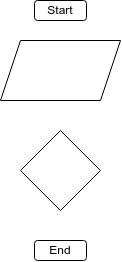

# README 
>Данный **РЕПОЗИТОРИЙ** создан как ***"Итоговая контрольная работа по основному блоку"***, в качестве домашнего задания и проверки усвоения материала студентом, знаний и навыков по итогу прохождения первого блока на программе **"Разработчик"** в школе онлайн обучения [GeekBrains](https://gb.ru/).

## Контрольная работа

### Задания
1. Создать [**репозиторий**](https://github.com/ivanshh86/ControlTest_1.git) на GitHub;

2. Нарисовать ***блок-схему** алгоритма* решения задачи (будет загружена сюда в виде файла - изображения, созданного в программе [Drawio](https://www.drawio.com/), можно загрузить [Desktop](https://github.com/jgraph/drawio-desktop/releases/tag/v21.6.5) версию данной программы, для любой платформы с сайта [GitHub](https://github.com/));

3. _**Снабдить** репозиторий_ оформленным текстовым описанием решения в виде файла *README*;

4. **Написать программу**, ~~выполняющую~~ решающую поставленную задачу;

5. **Использовать** _контроль версий_ в работе над проектом.

### *Задача*
Написать программу, которая из имеющегося массива строк формирует новый массив из строк, длина которых меньше, либо равна 3 символам. Первоначальный можно ввести с клавиатуры, либо задать на старте выполнения алгоритма. При решении не рекомендуется пользоваться коллекциями, лучше обойтись исключительно массивами.

## Блок-схема алгоритма

